# LaTeXTabX.jl

Publication-ready LaTeX tables in a consistent `tabularx` + `booktabs` style, from
`DataFrame`s and fitted regression models — regression tables, summary statistics,
correlation matrices, plain DataFrames, and fully hand-built multi-panel tables.

Every builder compiles to one small intermediate representation
(`TabXCell` → row → `TabXTable`) and renders to a **bare `tabularx` environment**
(no floating `table` wrapper unless you ask), so the output drops straight into
your document.

> **Naming.** Function names use a `latex*` prefix and the IR types a `TabX*`
> prefix, chosen to avoid collisions across the ecosystem (`regtable` is taken by
> RegressionTables.jl *and* TexTables.jl; `Table`/`Cell`/`summarytable` by
> TypedTables / TexTables / SummaryTables; `render` by Latexify). The package
> commits no type piracy — extensions only add methods to its own functions.

## Installation

LaTeXTabX is not registered — install it directly from GitHub:

```julia
using Pkg
Pkg.add(url = "https://github.com/<you>/LaTeXTabX.jl")
# for local development instead:
# Pkg.develop(path = "path/to/RegressionTable_TabX")
```

Regression-model support loads automatically through package extensions when the
relevant package is present — no extra setup.

### LaTeX preamble

```latex
\usepackage{tabularx}
\usepackage{booktabs}
\newcolumntype{Y}{>{\centering\arraybackslash}X}
```

## Builders at a glance

Each returns a `TabXTable`; render with `to_latex(t)`, write with
`write_latex(path, t)`, or pass `file=...`. `display(t)` renders LaTeX in
Pluto/Jupyter. The [gallery](#gallery) below shows every builder typeset.

> **Full API reference** (every keyword, default, the IR types, the extension
> hooks for new backends, and gotchas): **[`docs/REFERENCE.md`](docs/REFERENCE.md)**.
> Hand this file to an agent to wire LaTeXTabX into another project.

| Function | Makes | Key keywords |
|---|---|---|
| `latexreg(models...)` | regression tables | `labels`, `keep`/`drop`/`order`, `below`, `groups`, `estimator`, `stats`, `fixedeffects`/`fe_style`/`yes`/`no`, `print_controls`, standard-error rows (`print_se`/`print_cluster`/`se_collapse`, `ses`/`se_labels`/`cluster_labels`), `extralines`, `coltype` |
| `latexsummary(df)` | descriptive statistics | `stats`, `panels`, `vars`, `labels`, `digits` |
| `latexcorr(df)` | correlation matrices | `methods`, `panels`, `col_groups`/`col_labels`, `lower`, `labels` |
| `latextable(df)` | any DataFrame/Tables → LaTeX | `vars`, `header`/`labels`, `digits`, `commas` |
| `latexpanel(panels)` | hand-built multi-panel tables | `header`, `panel_format`, `digits` |

**Statistics for `latexreg`** — built-ins `:nobs :r2 :adjr2 :r2_within
:r2_mcfadden :r2_coxsnell :r2_nagelkerke :r2_deviance :aic :aicc :bic
:loglikelihood :deviance :dof :dof_residual :fstat :fstat_pval`, plus any custom
`"Label" => f(model)`. `latexsummary` built-ins `:mean :std :median :q25 :q75
:min :max :n :sum`, plus custom `"Label" => f(vector)`.

**Column types.** Every builder defaults the data columns to the `Y` column type;
pass `coltype="X"` / `"c"` / `"S"` (siunitx) / `"D{.}{.}{-1}"` (dcolumn, decimal
alignment), set `labelcol` for the first column, or give a full `colspec` to take
complete control.

## Backends & extensions

| Package | Estimator label | Extras |
|---|---|---|
| GLM.jl | OLS / Logit / Probit / Poisson | pseudo-R², AIC/BIC/… |
| FixedEffectModels.jl | OLS / IV (2SLS) | FE rows, **auto-detected SE** (classical / robust / one- & two-way cluster), within-R², F |
| StagDiDModels.jl | TWFE / Gardner (2022) / Sun & Abraham (2021) / Borusyak, Jaravel, Spiess (2023) | event-study / ATT rows |
| Regress.jl | OLS / IV (2SLS / LIML / Fuller / k-class) | **precise HC / HAC / cluster SE**, realized κ |

Any model implementing StatsAPI `coeftable` works through the generic path; the
extensions add response names, fixed-effect blocks, estimator labels, the
covariance type, and package-specific statistics. They activate automatically
**by package UUID**, so the model package need not be registered.

## Standard errors, detected automatically

`latexreg` reads each fitted model's covariance estimator and prints it without
being told — a **"Std. errors"** row (`Classical` / `Robust` / `HC1` / `HC3` /
`HAC(...)` / `Clustered`) and, when clustered, a separate **"Cluster"** row naming
the variable(s), two-way joined with `&` (interacted via `cluster_join=" $\times$ "`).
Regress.jl reports the exact kind (HC0–HC5, HAC kernels, CR1–CR3 through
CovarianceMatrices.jl); FixedEffectModels distinguishes classical / robust / one-
and two-way clustering. The type can differ freely across columns.

A row that is identical across all columns collapses away (`se_collapse`) — except
clustering, which is always surfaced. Everything is toggleable (`print_se`,
`print_cluster`) and overridable: `ses` swaps in post-estimation standard errors
(e.g. clustered SEs for a GLM logit, which can't cluster natively) and
**recomputes p-values and stars**, while `se_labels` / `cluster_labels` are
free-text per-column overrides. See tables [3](#post-estimation-clustered-ses),
[4](#fixed-effects-with-auto-detected-standard-errors), and
[5](#precise-se-types-from-regressjl).

## The IR escape hatch

Every builder returns a `TabXTable` — a column spec + a vector of rows — that you
can post-process or build by hand:

```julia
t = TabXTable(4; colspec = "lYYY")
push!(t.rows, TabXRule(:doublemid))
push!(t.rows, TabXRow([TabXCell(""), TabXCell("High"; align=:c), TabXCell("Low"; align=:c), TabXCell("Diff"; align=:c)]))
push!(t.rows, TabXCmidRule([(2, 4)]))
push!(t.rows, TabXRow([TabXCell("Mean"), TabXCell("0.072"), TabXCell("0.132"), TabXCell("\$-0.060^{***}\$")]))
push!(t.rows, TabXRule(:doublemid))
print(to_latex(t))
```

Building blocks: `TabXCell(text; span, align)`, `TabXRow`,
`TabXRule(:top/:mid/:doublemid/:bottom)`, `TabXCmidRule([(from,to), …])`,
`TabXRaw("…")`, `TabXTable`.

---

# Gallery

Every table below is the **actual typeset output** of
[`docs/showcase.jl`](docs/showcase.jl), which renders all builders and backends
into one PDF (`julia --startup-file=no docs/showcase.jl`). The running dataset is a
synthetic corporate-finance panel (firms × years); the code beside each image is
the call that produced it.

## Regression tables — `latexreg`

### Main results — OLS and Logit side by side

An automatic estimator row, relabelling/reordering, a dependent-variable header
(`ROA` for the OLS columns, `Distress` for the logit), a rich statistics block
(pseudo-R² fills in where R² is undefined), and a significance note.

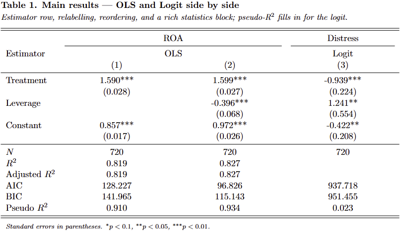

```julia
latexreg(m1, m2, logit;
    labels        = Dict("treat" => "Treatment", "lev" => "Leverage",
                         "size" => "Size", "(Intercept)" => "Constant"),
    depvar_labels = ["ROA", "ROA", "Distress"],
    order         = ["treat", "lev"],
    estimator     = :auto,
    stats         = [:nobs, :r2, :adjr2, :aic, :bic, :r2_mcfadden],
    notes         = ["Standard errors in parentheses. \$^{*}p<0.1\$, \$^{**}p<0.05\$, \$^{***}p<0.01\$."])
```

### Spanning multi-level headers

Adjacent equal labels merge into a `\multicolumn` with its own `\cmidrule`; the
intercept is dropped and an automatic "Controls" row appears.

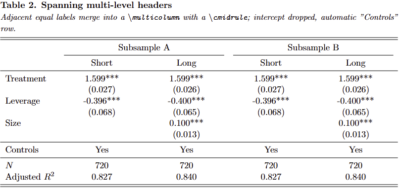

```julia
latexreg(m2, m3, m2, m3;
    labels = reglabels, drop = [r"Intercept"], depvar = false,
    number_regressions = false,
    groups = ["Subsample A" "Subsample A" "Subsample B" "Subsample B"
              "Short"       "Long"        "Short"       "Long"],
    stats  = [:nobs, :adjr2])
```

### Post-estimation clustered SEs

GLM can't cluster natively, so feed the standard errors in with `ses` — p-values
and stars are **recomputed** — and label the bottom rows with `se_labels` /
`cluster_labels` (free text).

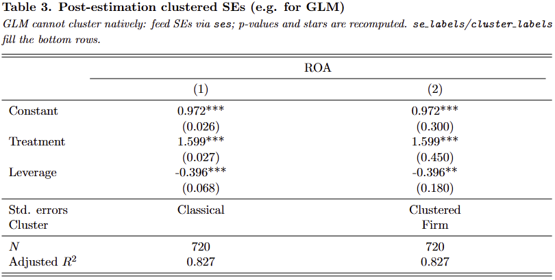

```julia
latexreg(m2, m2;
    labels         = reglabels, depvar_labels = ["ROA", "ROA"],
    ses            = [nothing, Dict("treat" => 0.45, "lev" => 0.18, "(Intercept)" => 0.30)],
    se_labels      = ["Classical", "Clustered"],
    cluster_labels = [nothing, "Firm"])
```

### Fixed effects with auto-detected standard errors

The same specification under four covariance estimators. The FE rows come from the
model; the "Std. errors" and "Cluster" rows are **read from each model's vcov** —
classical, robust, one-way and two-way clustering side by side.

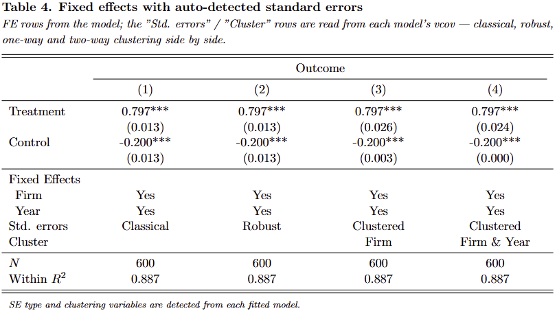

```julia
fe_c = reg(fdf, @formula(y ~ treat + ctrl + fe(id) + fe(t)))                        # classical
fe_r = reg(fdf, @formula(y ~ treat + ctrl + fe(id) + fe(t)), Vcov.robust())         # robust
fe_1 = reg(fdf, @formula(y ~ treat + ctrl + fe(id) + fe(t)), Vcov.cluster(:id))     # one-way
fe_2 = reg(fdf, @formula(y ~ treat + ctrl + fe(id) + fe(t)), Vcov.cluster(:id, :t)) # two-way

latexreg(fe_c, fe_r, fe_1, fe_2; labels = felabels, stats = [:nobs, :r2_within])
```

### Precise SE types from Regress.jl

Regress.jl exposes the exact estimator, so HC1 / HC3 / cluster-robust are printed
precisely (via CovarianceMatrices.jl), with the cluster variable on its own row.

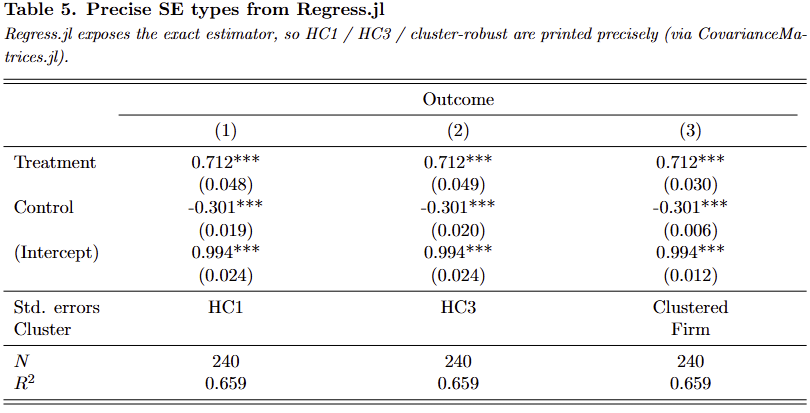

```julia
r_hc1 = Regress.ols(rsd, @formula(y ~ x + w))
r_hc3 = Regress.ols(rsd, @formula(y ~ x + w)) + Regress.vcov(Regress.HC3())
r_cr  = Regress.ols(rsd, @formula(y ~ x + w), save_cluster = :firm) + Regress.vcov(Regress.CR1(:firm))

latexreg(r_hc1, r_hc3, r_cr;
    labels = Dict("x" => "Treatment", "w" => "Control", "firm" => "Firm"),
    stats  = [:nobs, :r2])
```

### Staggered DiD — three estimators

Modern heterogeneity-robust estimators side by side; the estimator row names each
method from StagDiDModels.jl.

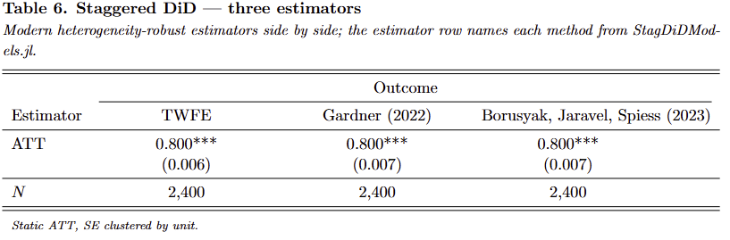

```julia
latexreg(twfe, gardner, bjs;
    labels = Dict("_ATT" => "ATT", "dep_var" => "Outcome"),
    estimator = :show, number_regressions = false, stats = [:nobs])
```

### Instrumental variables / k-class

OLS vs 2SLS vs LIML; the estimator row reports the method and the realized κ.

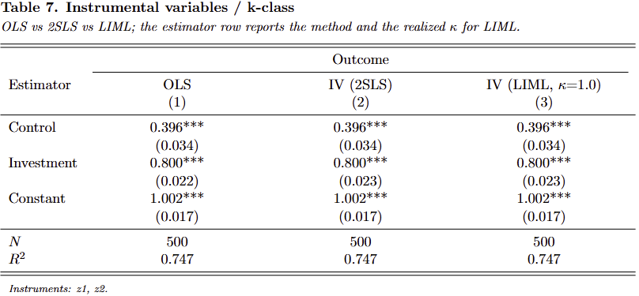

```julia
latexreg(ols, tsls, liml;
    labels    = Dict("endo" => "Investment", "x" => "Control",
                     "(Intercept)" => "Constant", "y" => "Outcome"),
    estimator = :auto, stats = [:nobs, :r2])
```

### Compact fixed-effect markers

`fe_style=:compact` folds the FE label into the row; ticks for "yes", blank for "no".

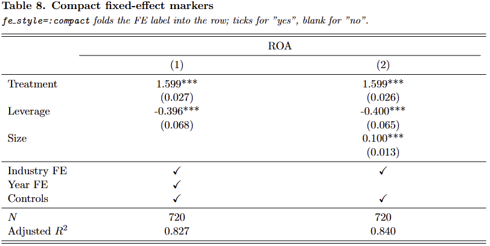

```julia
latexreg(m2, m3;
    labels = reglabels, depvar_labels = ["ROA", "ROA"], drop = [r"Intercept"],
    fixedeffects = ["Industry" => true, "Year" => [true, false]],
    fe_style = :compact, yes = "\\checkmark", no = "", stats = [:nobs, :adjr2])
```

## Summary statistics — `latexsummary`

### Descriptives grouped into panels

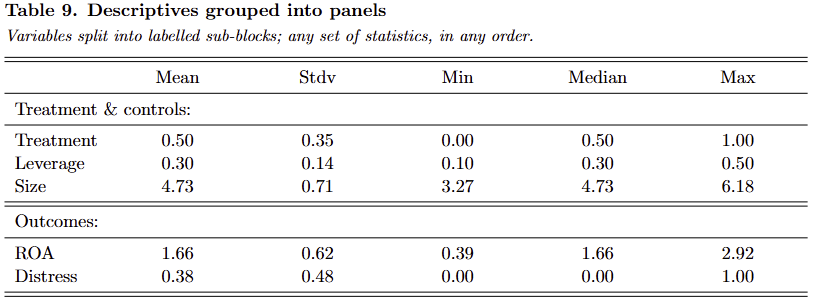

```julia
latexsummary(df;
    stats  = [:mean, :std, :min, :median, :max],
    panels = ["Treatment \\& controls:" => [:treat, :lev, :size], "Outcomes:" => [:roa, :distress]],
    labels = Dict("treat" => "Treatment", "lev" => "Leverage", "size" => "Size",
                  "roa" => "ROA", "distress" => "Distress"))
```

### A custom statistic alongside built-ins

Pass `"Label" => f(vector)` for anything not built in (here the inter-quartile range).

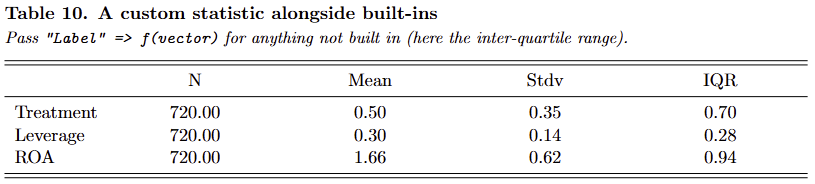

```julia
latexsummary(df;
    vars   = [:treat, :lev, :roa],
    stats  = [:n, :mean, :std, "IQR" => (v -> quantile(v, 0.75) - quantile(v, 0.25))],
    labels = Dict("treat" => "Treatment", "lev" => "Leverage", "roa" => "ROA"))
```

## Correlation tables — `latexcorr`

### Pearson and Spearman, stacked

Each method is its own block — a clean square matrix with no redundant labels.

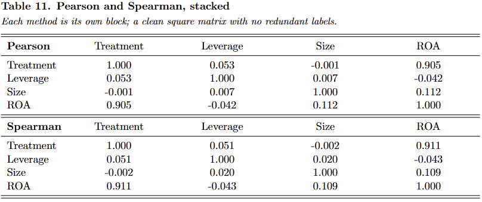

```julia
latexcorr(df;
    methods = [:pearson, :spearman],
    vars    = [:treat, :lev, :size, :roa],
    labels  = Dict("treat" => "Treatment", "lev" => "Leverage", "size" => "Size", "roa" => "ROA"))
```

### Grouped columns, lower triangle

A multi-level column header (every top-level group underlined) with the lower
triangle only.

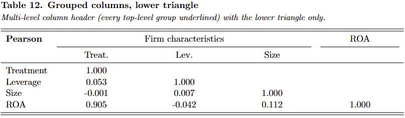

```julia
latexcorr(df;
    vars       = [:treat, :lev, :size, :roa],
    methods    = [:pearson],
    lower      = true,
    col_groups = ["Firm characteristics" => 1:3],
    labels     = Dict("treat" => "Treatment", "lev" => "Leverage", "size" => "Size", "roa" => "ROA"),
    col_labels = Dict("treat" => "Treat.", "lev" => "Lev.", "size" => "Size"))
```

## Plain DataFrames & hand-built panels

### A DataFrame, printed cleanly

Column names as the header, **no row-number column** (the thing
`display("text/latex", df)` gets wrong); integers stay integers, strings are escaped.

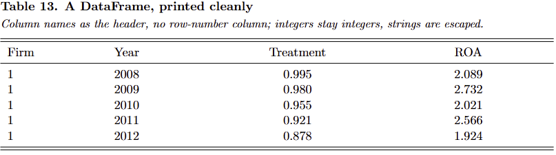

```julia
latextable(first(select(df, [:firm, :year, :treat, :roa]), 5);
    labels = Dict("firm" => "Firm", "year" => "Year", "treat" => "Treatment", "roa" => "ROA"),
    digits = 3)
```

### Fully hand-built multi-panel table — `latexpanel` / `panel`

Numbers auto-format, strings pass through verbatim (`$-0.060^{***}$`); `:rule`
inserts a midrule within a panel; short rows are padded.

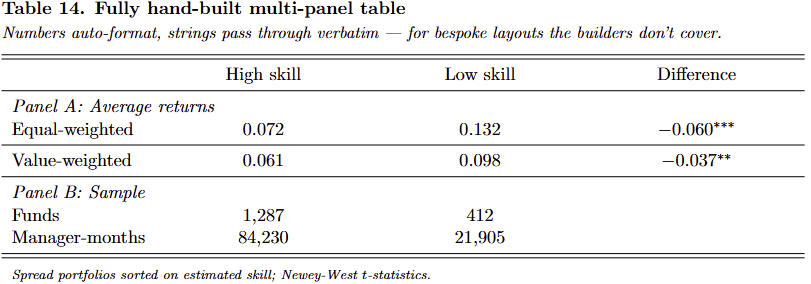

```julia
latexpanel(
    [
        panel("Panel A: Average returns",
            ["Equal-weighted", 0.072, 0.132, "\$-0.060^{***}\$"],
            :rule,
            ["Value-weighted", "\$0.061\$", "\$0.098\$", "\$-0.037^{**}\$"]),
        panel("Panel B: Sample",
            ["Funds", "1,287", "412"],
            ["Manager-months", "84,230", "21,905"]),
    ];
    header = ["High skill", "Low skill", "Difference"],
    notes  = ["Spread portfolios sorted on estimated skill; Newey-West \$t\$-statistics."])
```

---

The full runnable source for the gallery is [`docs/showcase.jl`](docs/showcase.jl);
backend-specific smoke tests live in [`test/`](test/). The compiled PDFs land in
`latex/` (gitignored).
